``` r
library(tidyverse)
library(tidytext)
library(lubridate)
```

<br />

### Load data from Washington Post’s Github

``` r
homicides <- read_csv("https://raw.githubusercontent.com/washingtonpost/data-homicides/master/homicide-data.csv", na = "Unknown")
```

``` r
homicides <- homicides %>%
    mutate(reported_date = ymd(reported_date))
```

<br />

### How do the number of homicides change over time?

``` r
homicides %>% 
    mutate(reported_date = year(reported_date),
           reported_date = as_factor(reported_date)) %>% 
    count(reported_date) %>%
    drop_na(reported_date) %>%
    ggplot(aes(reported_date, n, group = 1)) + 
    geom_line() +
    geom_point() +
    labs(x = "Year",
         y = "Count") +
    expand_limits(y = 0)
```

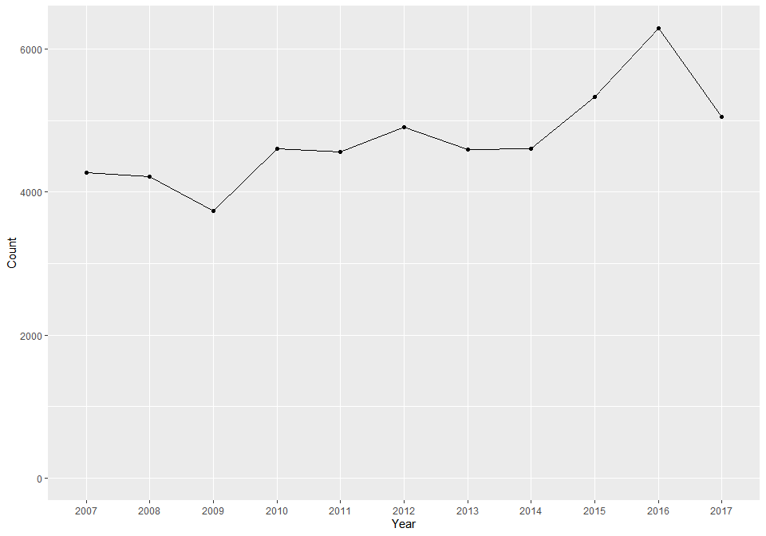

<br />

### What is the distribution of homicides by race over time?

``` r
homicides %>% 
    mutate(reported_date = year(reported_date),
           reported_date = as_factor(reported_date)) %>% 
    count(reported_date, victim_race) %>%
    drop_na(reported_date) %>%
    ggplot(aes(reported_date, n, fill = victim_race)) + 
    geom_col() +
    labs(x = "Year",
         y = "Count", 
         fill = "Race")
```

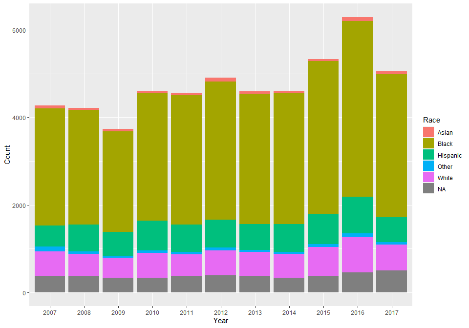

<br />

### How many homicides are closed or remain open?

``` r
homicides %>%
    count(disposition) %>%
    mutate(disposition = fct_reorder(disposition, -n)) %>%
    ggplot(aes(disposition, n, fill = disposition)) + 
    geom_col() +
    labs(x = "Disposition",
         y = "Count") +
    theme(legend.position = "none")
```

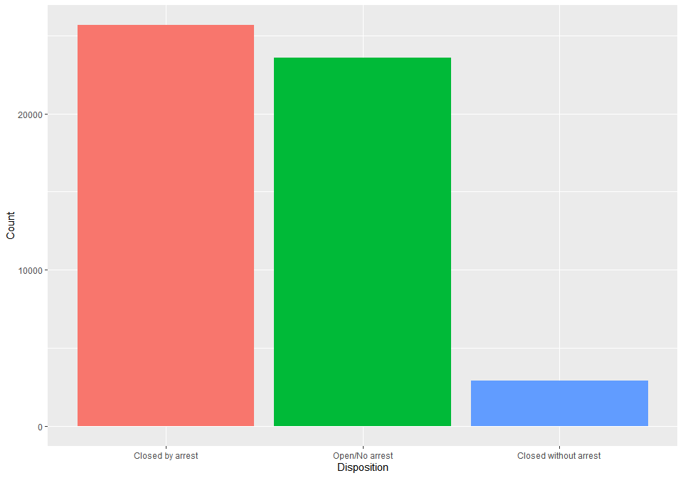

<br />

### How many homicides are closed or remain open over time?

``` r
homicides %>% 
    mutate(reported_date = year(reported_date),
           reported_date = as_factor(reported_date)) %>% 
    count(reported_date, disposition) %>%
    drop_na(reported_date) %>%
    ggplot(aes(reported_date, n, fill = disposition)) + 
    geom_col() +
    labs(x = "Year",
         y = "Count", 
         fill = "Disposition")
```

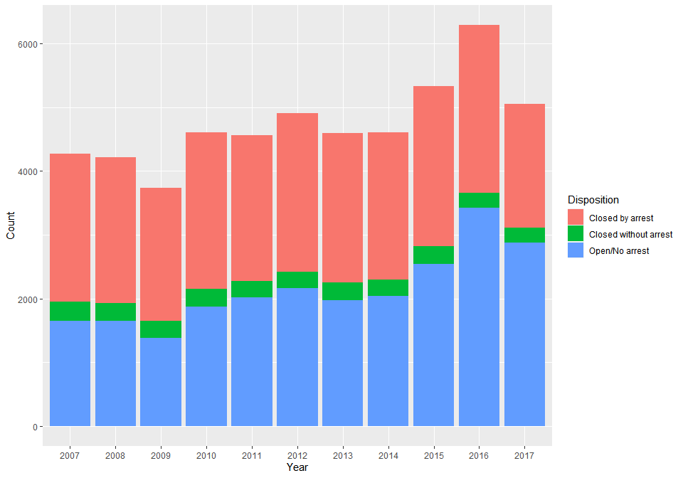

<br />

### How many homicides are closed or remain open by race?

``` r
homicides %>% 
    count(victim_race, disposition) %>%
    ggplot(aes(victim_race, n, fill = disposition)) + 
    geom_col() +
    labs(x = "Race",
         y = "Count", 
         fill = "Disposition")
```

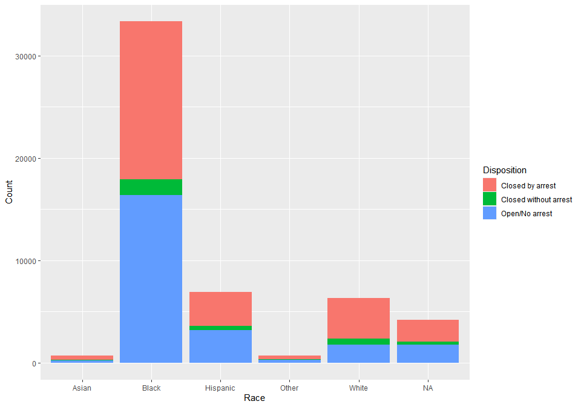

<br />

### How many homicides are closed or remain open by sex?

``` r
homicides %>% 
    count(victim_sex, disposition) %>%
    drop_na(victim_sex) %>%
    ggplot(aes(victim_sex, n, fill = disposition)) + 
    geom_col() +
    labs(x = "Sex",
         y = "Count", 
         fill = "Disposition")
```


<br />

### What is the distribution of homicides for race and sex?

``` r
homicides %>% 
    count(victim_sex, victim_race) %>%
    drop_na(victim_sex) %>%
    ggplot(aes(victim_sex, n, fill = victim_race)) + 
    geom_col() +
    labs(x = "Sex",
         y = "Count",
         fill = "Race")
```

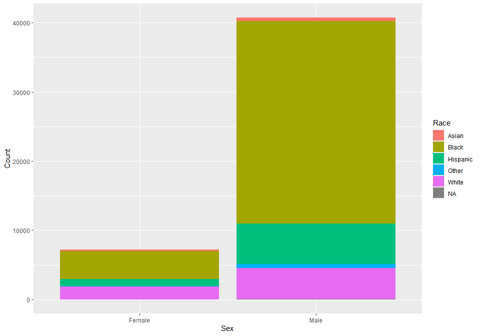

<br />

### The same plot as above, but by percentage per sex

``` r
homicides %>% 
    drop_na(victim_sex) %>%
    ggplot(aes(victim_sex, fill = victim_race)) + 
    geom_bar(position = "fill") +
    labs(x = "Sex",
         y = "Percent",
         fill = "Race") +
    scale_y_continuous(labels = scales::percent)
```


<br />

### What is the age distribution of homicide victims?

``` r
homicides %>%
    drop_na(victim_sex) %>%
    ggplot(aes(victim_age)) +
    geom_histogram(bins = 10) +
    labs(x = "Age",
         y = "Count")
```

    ## Warning: Removed 390 rows containing non-finite values (stat_bin).

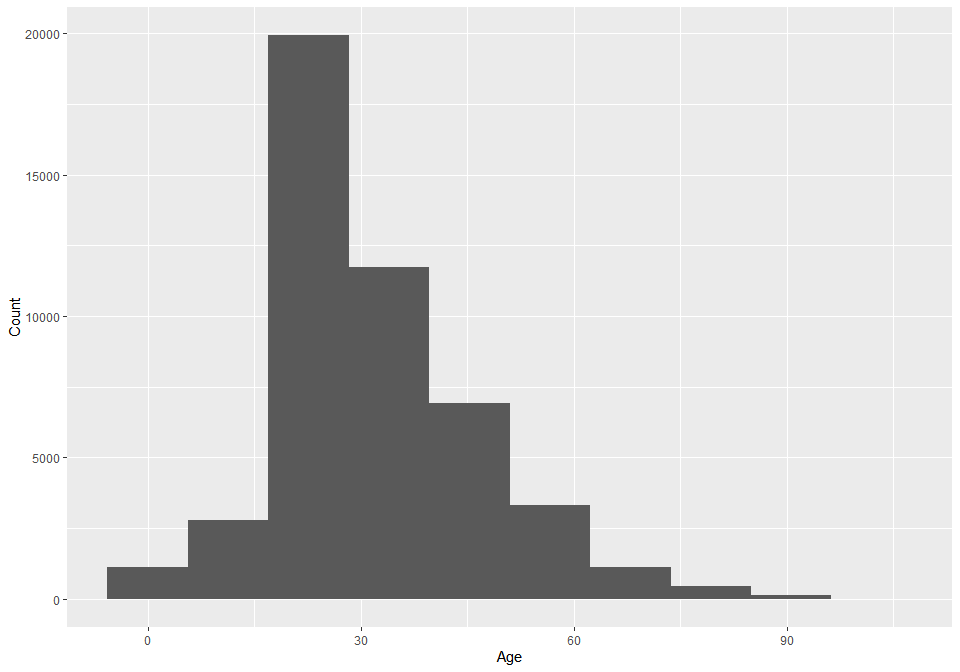

<br />

### What is the age distribution of homicide victims by sex?

``` r
homicides %>%
    drop_na(victim_sex) %>%
    ggplot(aes(victim_age, fill = victim_sex)) +
    geom_histogram(bins = 10) +
    labs(x = "Age",
         y = "Count",
         fill = "Sex")
```

    ## Warning: Removed 390 rows containing non-finite values (stat_bin).

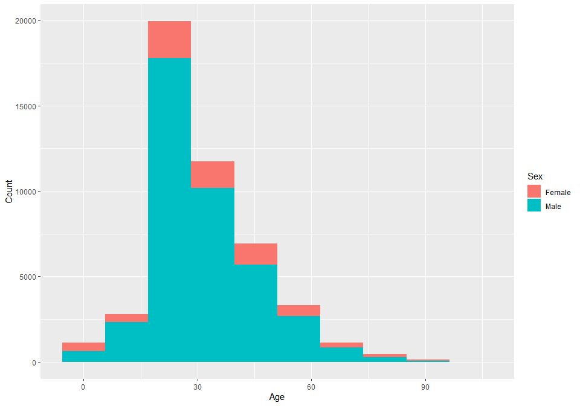

<br />

### What is the age distribution of homicide victims by race?

``` r
homicides %>%
    drop_na(victim_sex) %>%
    ggplot(aes(victim_age, fill = victim_race)) +
    geom_histogram(bins = 10) +
    labs(x = "Age",
         y = "Count",
         fill = "Race")
```

    ## Warning: Removed 390 rows containing non-finite values (stat_bin).

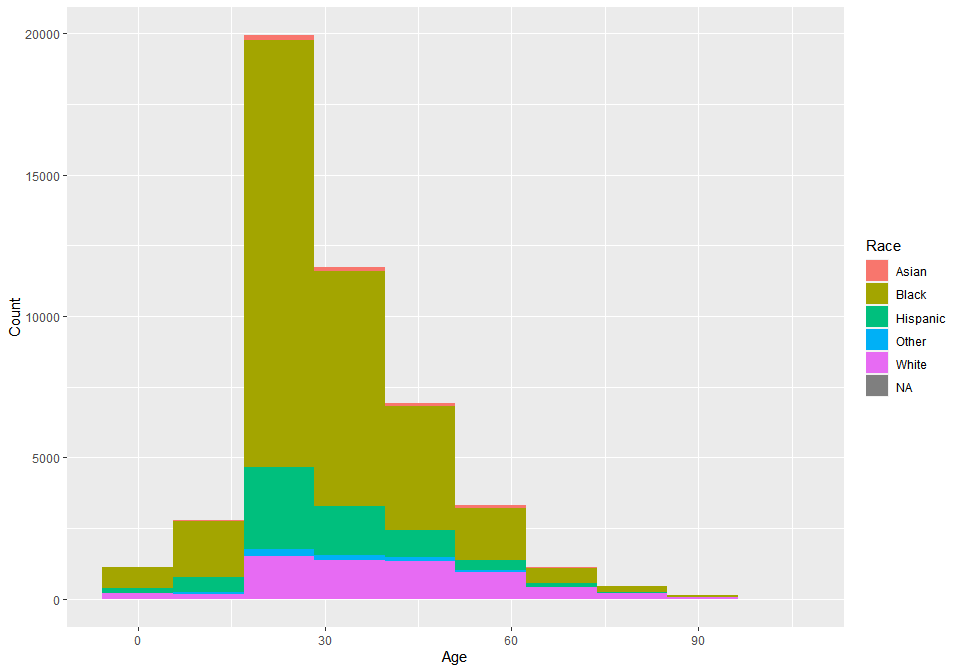

<br />

### What states are the hot spots of homicide?

``` r
homicides %>%
    count(state) %>%
    mutate(state = fct_reorder(state, n)) %>%
    ggplot(aes(n, state)) +
    geom_col() +
    labs(x = "Count",
         y = "State")
```


<br />

### Same plot as above but broken down by disposition

``` r
homicides %>%
    count(state, disposition) %>%
    mutate(state = fct_reorder(state, n, .fun = sum)) %>%
    ggplot(aes(n, state, fill = disposition)) +
    geom_col() +
    labs(x = "Count",
         y = "State",
         fill = "Disposition") +
    guides(fill = guide_legend(reverse=T))
```

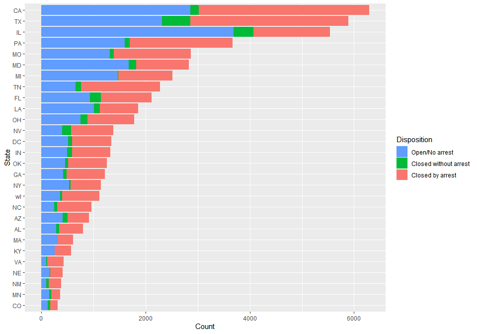

<br />

### What states have the highest level of homicides without arrests?

``` r
homicides %>%
    group_by(state) %>%
    summarize(pct_without_arrest = sum(disposition != c("Closed by arrest")) / n()) %>%
    ungroup() %>% 
    mutate(state = fct_reorder(state, pct_without_arrest)) %>%
    ggplot(aes(pct_without_arrest, state)) +
    geom_col() +
    labs(x = "Percentage of homicides without arrest",
         y = "State") +
    scale_x_continuous(labels = scales::percent)
```

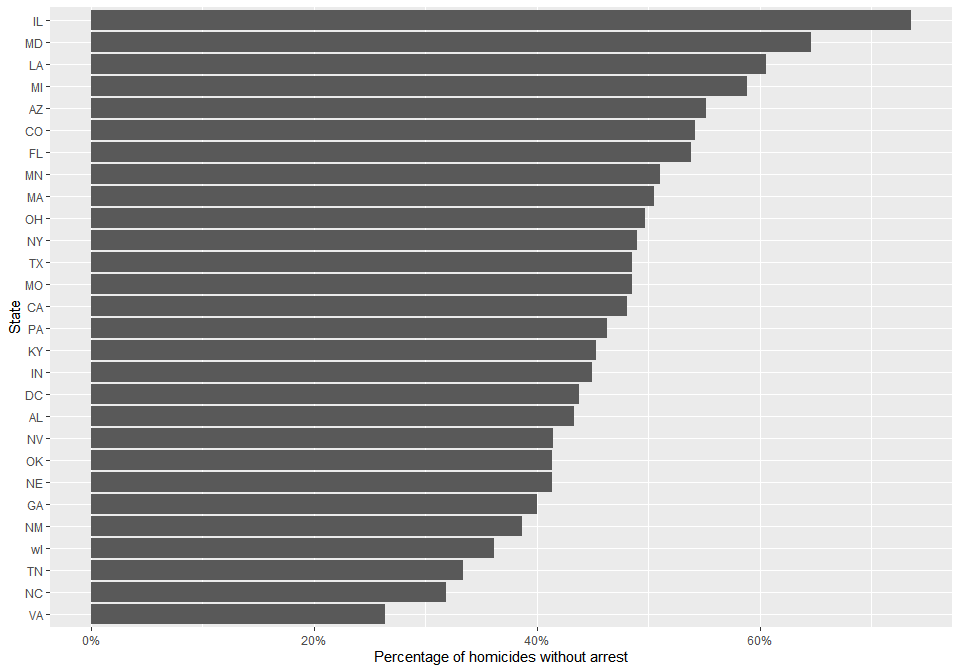

<br />

### What are the top hot spot cities in the data for each of the top 9 states with most homicides?

``` r
homicides %>%
    filter(fct_lump(state, 9) != "Other") %>%
    group_by(state) %>%
    count(city) %>% 
    ungroup() %>%
    mutate(city = reorder_within(city, n, state),
           state = fct_reorder(state, -n, .fun = sum)) %>%
    ggplot(aes(n, city)) +
    geom_col() +
    facet_wrap(~state, scales = "free_y") +
    scale_y_reordered() +
    labs(x = "Count",
         y = "City")
```

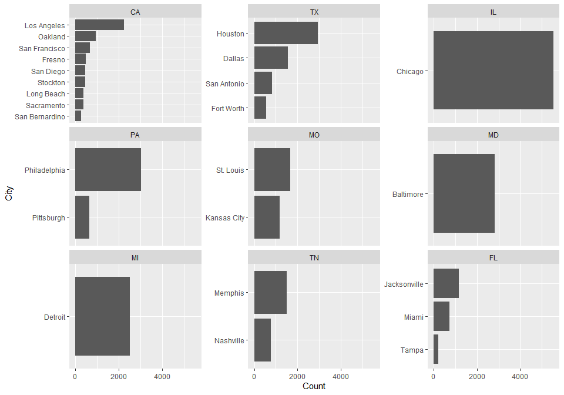

<br /> <br /> <br /> <br />
